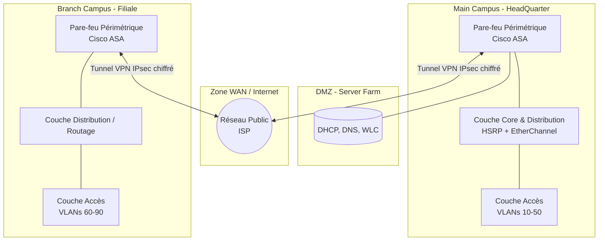

# 🎓 Architecture Réseau Campus Sécurisée (Cisco)

**Objectif du projet :** Concevoir et simuler une infrastructure réseau campus évolutive, sécurisée et redondante visant à unifier les communications de multiples départements (Health, Business, Engineering, etc.) tout en centralisant la gestion du réseau sans-fil.

## 🏗️ 1. Architecture Hiérarchique Modulaire (Cisco 3-Tiers)

L'architecture repose sur le modèle hiérarchique Cisco à trois couches pour garantir l'évolutivité et faciliter le dépannage.

* **Couche Core (Cœur) :** Constitue l'épine dorsale du réseau, dédiée à la commutation ultra-rapide entre les services et la distribution. Les équipements sont interconnectés via EtherChannel pour la tolérance aux pannes et maximiser la bande passante, sans être ralentis par des politiques ACL complexes.
* **Couche Distribution :** Agit comme frontière intelligente gérant le routage inter-VLAN et l'application des politiques de sécurité (ACLs). Les liaisons Trunks (802.1Q) utilisent le VLAN 666 comme VLAN natif pour renforcer la sécurité.
* **Couche Accès :** Gère la connectivité des terminaux finaux. Les utilisateurs sont isolés dans des VLANs spécifiques (10 à 90) selon leur département. La topologie est protégée contre les boucles et les branchements sauvages via les protocoles BPDU Guard et PortFast. De plus, les ports inactifs sont confinés dans un VLAN "Blackhole" (999).

## 🔒 2. Sécurité Périmétrique et Inter-Sites

La sécurité a été pensée en couches successives, depuis le port physique jusqu'au réseau étendu.

* **Pare-feux Cisco ASA :** Déploiement de zones de sécurité strictes bloquant par défaut tout trafic provenant de l'extérieur (Outside). Seul le trafic autorisé par des règles d'inspection spécifiques peut traverser.
* **Tunnel VPN IPsec :** Création d'une interconnexion sécurisée entre le siège (HQ) et la filiale (Branch) au travers d'Internet. Le processus utilise IKEv1 (Phase 1) pour l'authentification par clé pré-partagée et IPsec (Phase 2) pour le chiffrement des données en transit.

## 📡 3. Gestion Centralisée du Sans-Fil

* **Contrôleur WLC & CAPWAP :** Centralisation de toute la gestion des points d'accès Wi-Fi via un contrôleur dédié (WLC), évitant la configuration individuelle de chaque borne.
* **Authentification Stricte :** Seules les bornes possédant un certificat validé (SSC/MIC) sont autorisées à rejoindre le contrôleur, empêchant l'ajout de bornes pirates et assurant une mobilité sécurisée.

## ⚙️ 4. Haute Disponibilité et Évolutivité

L'infrastructure est conçue pour absorber les pannes et s'adapter automatiquement aux extensions.

* **Redondance de Passerelle (HSRP) :** Implémentation du protocole HSRP sur la couche distribution, créant une passerelle virtuelle pour un basculement instantané et transparent en cas de panne matérielle d'un routeur.
* **Routage Dynamique (OSPF) :** Automatisation des échanges de routes entre les pare-feux et les routeurs. Cela permet au réseau de découvrir dynamiquement de nouveaux sous-réseaux (comme ceux de la filiale) sans configuration statique fastidieuse.
* **Services Centralisés (DHCP Relay) :** Utilisation de la fonction "ip helper-address" pour intercepter les requêtes DHCP locales et les relayer vers une ferme de serveurs centralisée en DMZ, simplifiant considérablement l'administration système.
