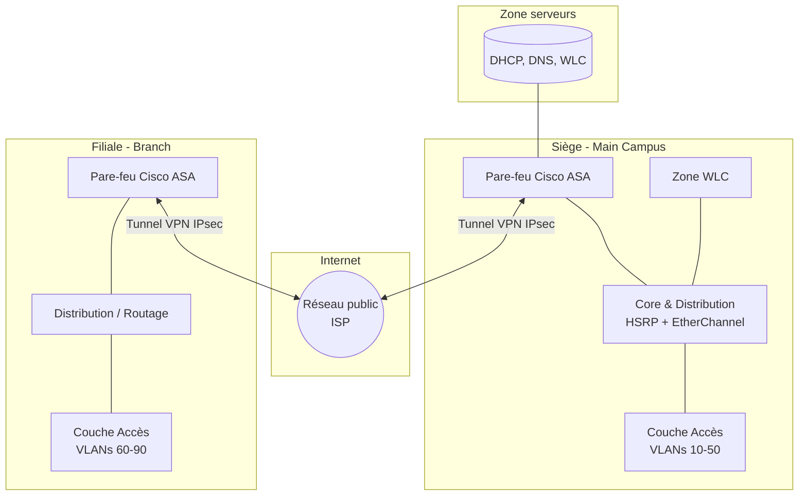

# Architecture réseau campus sécurisée (Cisco)

**Objectif :** concevoir et simuler dans **Cisco Packet Tracer** un réseau d'entreprise multi-sites (siège + filiale) segmenté par département (Health, Business, Engineering…), sécurisé et redondant, avec une gestion centralisée du Wi-Fi.

```mermaid
graph TD
    subgraph DMZ [Zone serveurs]
        Servers[(DHCP, DNS, WLC)]
    end

    subgraph HQ [Siège - Main Campus]
        ASA_HQ[Pare-feu Cisco ASA]
        Core[Core & Distribution<br/>HSRP + EtherChannel]
        Acc[Couche Accès<br/>VLANs 10-50]
        WLC[Zone WLC]
        ASA_HQ --- Core
        WLC --- Core
        Core --- Acc
    end

    subgraph WAN [Internet]
        ISP((Réseau public<br/>ISP))
    end

    subgraph Branch [Filiale - Branch]
        ASA_BR[Pare-feu Cisco ASA]
        Dist_BR[Distribution / Routage]
        Acc_BR[Couche Accès<br/>VLANs 60-90]
        ASA_BR --- Dist_BR
        Dist_BR --- Acc_BR
    end

    Servers --- ASA_HQ
    ASA_HQ <-->|Tunnel VPN IPsec| ISP
    ASA_BR <-->|Tunnel VPN IPsec| ISP
```

## 1. Architecture hiérarchique (modèle Cisco 3 tiers)

- **Core :** épine dorsale du réseau, liens agrégés en EtherChannel pour la redondance et la bande passante, sans ACL pour ne pas ralentir la commutation.
- **Distribution :** routage inter-VLAN et application des ACLs. Les trunks 802.1Q utilisent le VLAN 666 comme VLAN natif.
- **Accès :** chaque département est isolé dans son VLAN (10 à 50 au siège, 60 à 90 à la filiale). BPDU Guard et PortFast protègent contre les boucles et les branchements non autorisés, et les ports inutilisés sont placés dans un VLAN « blackhole » (999).

## 2. Sécurité périmétrique et inter-sites

- **Pare-feu Cisco ASA :** tout trafic venant de l'extérieur (outside) est bloqué par défaut, seuls les flux autorisés par des règles d'inspection passent.
- **VPN IPsec site à site :** tunnel chiffré entre le siège et la filiale à travers Internet (IKEv1 avec clé pré-partagée en phase 1, IPsec en phase 2).

## 3. Wi-Fi centralisé

- **Contrôleur WLC et CAPWAP :** tous les points d'accès sont gérés depuis un contrôleur central, sans configuration borne par borne.

## 4. Haute disponibilité et services

- **HSRP :** passerelle virtuelle partagée entre deux équipements de distribution, pour basculer automatiquement en cas de panne.
- **OSPF :** routage dynamique entre les pare-feux et les routeurs. Les réseaux de la filiale sont appris automatiquement.
- **DHCP Relay :** `ip helper-address` relaie les requêtes DHCP des VLANs vers les serveurs centralisés.
