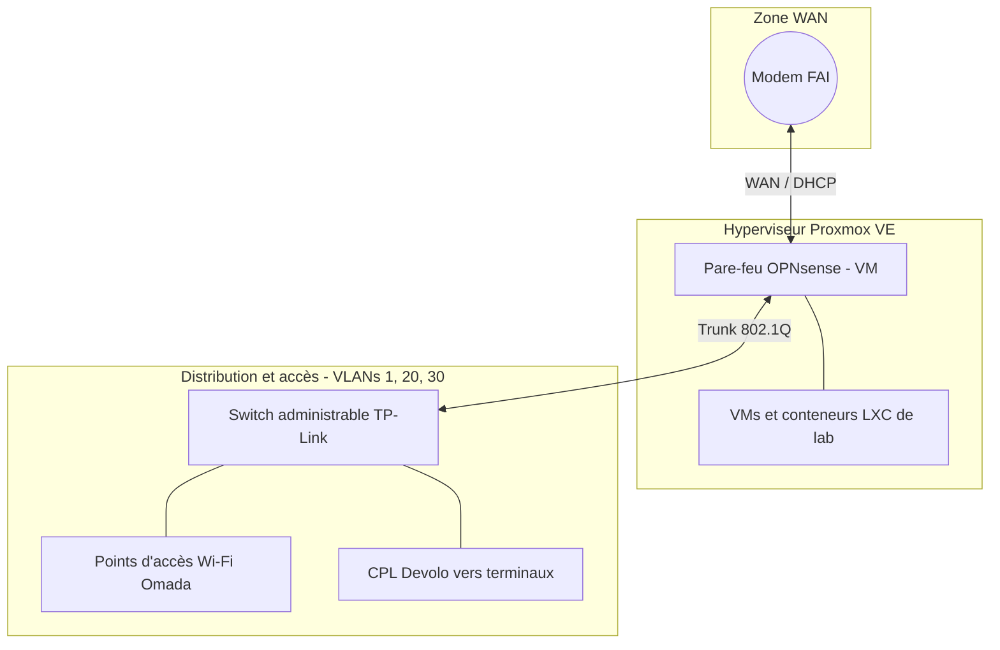

# Infrastructure réseau & virtualisation (Homelab)

**Objectif :** concevoir et administrer un réseau domestique segmenté, avec un pare-feu virtualisé, une séparation stricte des flux par VLAN et une documentation de la topologie physique et logique.

## 1. Virtualisation (Proxmox VE)

- Hyperviseur Proxmox VE installé en bare-metal.
- OPNsense tourne en machine virtuelle et sert de routeur principal.
- Machines virtuelles et conteneurs LXC pour les services de lab et les tests.

## 2. Routage et sécurité (OPNsense)

- OPNsense assure le routage inter-VLAN, le NAT et le DHCP de chaque réseau.
- Les règles de pare-feu appliquent le moindre privilège : tout trafic inter-VLAN est bloqué par défaut, seuls les flux nécessaires sont autorisés.

| VLAN | Réseau | Rôle | Accès |
|---|---|---|---|
| 1 | LAN privé | Postes principaux | Internet + administration |
| 20 | IoT | Objets connectés | Internet uniquement, aucun accès au LAN |
| 30 | Invités | Wi-Fi invités | Internet uniquement, totalement isolé |

## 3. Segmentation et distribution

- Le switch TP-Link reçoit les VLANs depuis OPNsense via un lien trunk 802.1Q.
- Les points d'accès Omada associent chaque SSID à son VLAN.
- Des adaptateurs CPL Devolo étendent le réseau vers les terminaux éloignés.

## 4. Documentation

- Topologie physique et logique documentée avec Draw.io.
